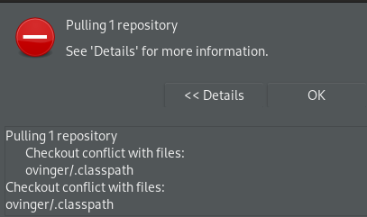
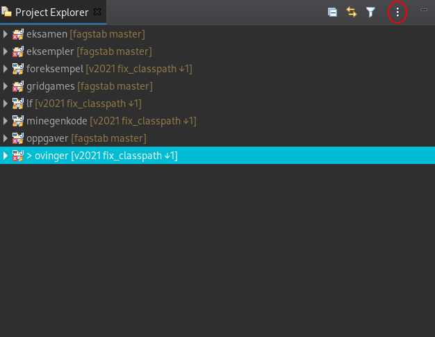
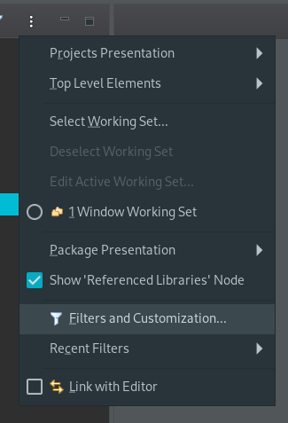
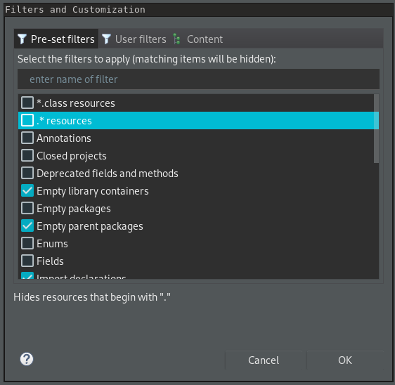
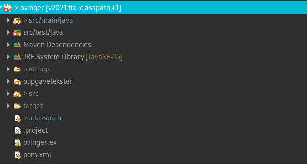
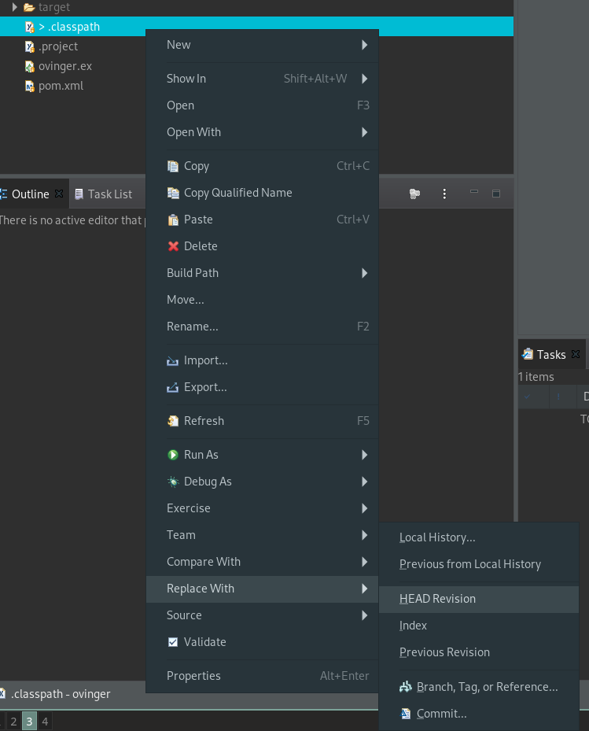
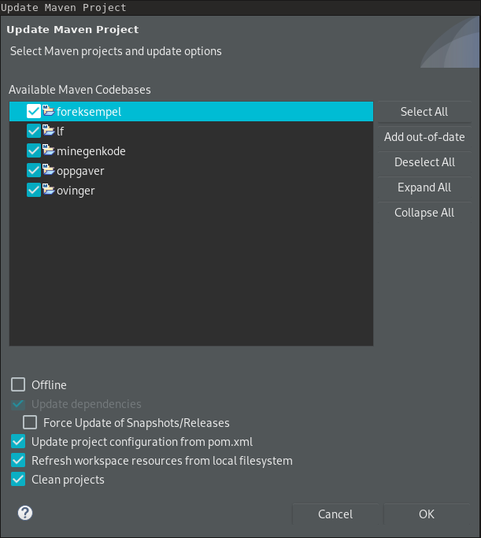

# Fiks ved problemer med å pulle i Eclipse

Dersom du får problemer med å pulle øvinger i Eclipse, med feilmelding som vist i bildet under ("Checkout conflict with files: `<prosjektnavn>/.classpath`), kan du følge denne guiden for å løse problemet.

**NB!** Bildene i denne guiden går ut i fra at problemfilen ligger i `ovinger`-prosjektet, men det kan også være under et av de andre prosjektene.
Du kan se hvilke filer som er problematiske i feilmeldinga du får når du puller.

| Beskrivelse | Bilde |
|------|-------|
| I Project-explorer i Eclipse, trykk på de tre prikkene i øvre høyre hjørne. I menyen som kommer opp velger du *Filters and Customization...* (I MacOS står det kun *Filters...*). |   |
| I vinduet som kommer opp, pass på at valget `.* resources` **IKKE** er valgt, og trykk ok. |  |
| Åpne prosjektet du hadde konflikter i, dette er sannsynligvis ovinger. Du vil se at det har dukket opp en fil som heter `.classpath` under prosjektmappa. |  |
| Høyreklikk på `.classpath`-fila, og velg *Replace With* -> *HEAD Revision*. Trykk *Discard Changes* i vinduet som kommer opp. | ) |
| Nå kan du prøve å pulle igjen (høyreklikk på prosjektet og velg *Team* -> *Pull*). Sannsynligvis vil prosjektet nå se ganske kaotisk ut, med veldig mange mapper. Det fikser du enkelt ved å høyreklikke på det, og velge *Maven* -> *Update Project*, velge alle prosjektene, og trykke *OK* |  |

Etter denne prosessen skal alt fungere som før. Har du problemer, ta kontakt med undass.